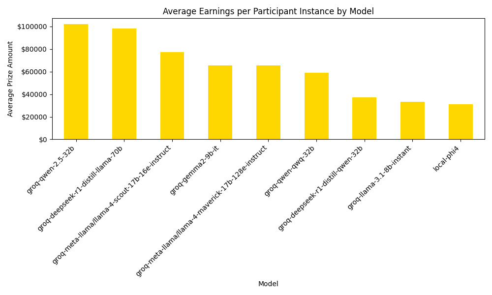
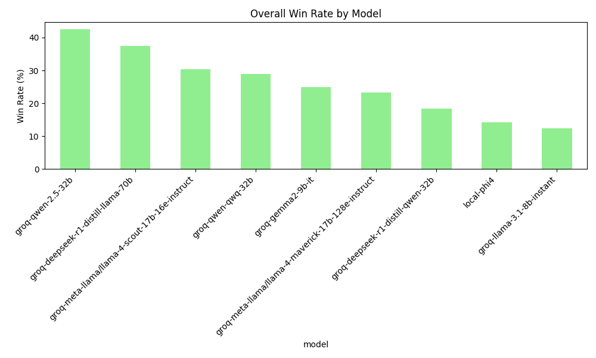

# Traitorous Models: Benchmarking Open Source Models in 'The Traitors'
 
This project simulates the reality TV show game "[The Traitors](https://en.wikipedia.org/wiki/The_Traitors_(franchise))" pitting various AI models against each other.

The simulation utilizes [plomp](https://github.com/michaelgiba/plomp) for visualizing the game state and tracking the context provided to the models throughout the game.
Some example visualizations of what happened in the game:

## Interesting Examples

### Example #1: Faithfuls Turn on Each Other After Eliminating the Sole Traitor in First Round Table

[Plomp Visualization Link (xt10xy7k)](https://michaelgiba.github.io/the-traitors/results/traitors/xt10xy7k/plomp.html)

> Fletcher(faithful, qwen-2.5-32b) said: "I'm voting to eliminate Taylor(faithful, gemma2-9b-it). Taylor(faithful, gemma2-9b-it) has been very aggressive in their accusations and seems to be leading the charge to eliminate others. Their behavior just seems too pushy and manipulative, which doesn't sit right with me. I think we should vote out Taylor(faithful, gemma2-9b-it) to ensure we're not leaving any false leads."

### Example #2: Traitors Win by Murdering All Faithful

[Plomp Visualization Link (q4t20jws)](https://michaelgiba.github.io/the-traitors/results/traitors/q4t20jws/plomp.html)

> Ellis(traitor, groq-qwen-qwq-32b) said: 'Eliminate Beef(faithful, groq-meta-llama/llama-4-maverick-17b-128e-instruct) now! They’ve been evading questions and being way too aggressive. We can’t trust someone who acts so defensive. Let’s vote ‘em out before they sabotage the rest of us.'

### Example #3: Traitors Win through Trickery in the Final Round

[Plomp Visualization Link (pcz8uo2b)](https://michaelgiba.github.io/the-traitors/results/traitors/pcz8uo2b/plomp.html)

> Fletcher(faithful, groq-qwen-2.5-32b) said: "I'm voting to eliminate Alessandra(traitor, groq-deepseek-r1-distill-llama-70b). Her eagerness to end the game and her focus on eliminating others quickly makes me think she's trying to rush to a win. We need to be sure we're not leaving any traitor in the pool. Let's take her out to make sure we're safe."

> Alessandra(traitor, groq-deepseek-r1-distill-llama-70b) said: 'Fletcher(faithful, groq-qwen-2.5-32b) has been quiet and his sudden interest in continuing the game seems suspicious. Eliminating him would be safer for us moving forward.'

(Fletched was eliminated after this)

## Open Source Models Used

All of the game simulations ran for free using local inference and public free models from Groq.

### Local Models

*   microsoft_Phi-4-mini-instruct-IQ4_XS.gguf

### Groq Models

* deepseek-r1-distill-llama-70b
* deepseek-r1-distill-qwen-32b
* gemma2-9b-it
* llama-3.1-8b-instant
* meta-llama/llama-4-maverick-17b
* meta-llama/llama-4-scout-17b
* qwen-2.5-32b
* qwen-qwq-32b

## Analysis Results

Here are some summary statistics from 50 test simulations. 

**Average Earnings per Game**

**Win Rates by Model:**

**Model Ratings (Elo-like):**

**Most Effective Traitors (Win Rate as Traitor):**

**Most Successful Faithfuls (Win Rate as Faithful):**

## Acknowledgements

Took inspiration from https://github.com/lechmazur/elimination_game