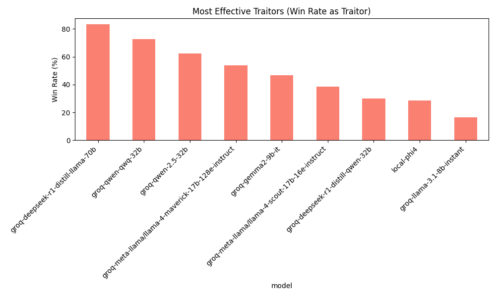

# Traitorous Models: Benchmarking Open Source Models in 'The Traitors'
 
This project simulates the reality TV show game "[The Traitors](https://en.wikipedia.org/wiki/The_Traitors_(franchise))" pitting various AI models against each other.

## Some Exciting Playbacks

The simulation utilizes [plomp](https://github.com/michaelgiba/plomp) for visualizing the game state and tracking the context provided to the models throughout the game.
Some example visualizations of what happened in the game:

Result: <QUOTE>
- HTML Link

Result: <QUOTE>
- HTML Link

Result: <QUOTE>
- HTML Link

## Open Source Models Used

All of the game simulations ran for free using local inference and public free models from Groq.

### Local Models

*   microsoft_Phi-4-mini-instruct-IQ4_XS.gguf

### Groq Models

* deepseek-r1-distill-llama-70b
* deepseek-r1-distill-qwen-32b
* gemma2-9b-it
* llama-3.1-8b-instant
* meta-llama/llama-4-maverick-17b
* meta-llama/llama-4-scout-17b
* qwen-2.5-32b
* qwen-qwq-32b

## Analysis Results

Here are some summary statistics from simulations. 

**Win Rates by Model:**

**Model Ratings (Elo-like):**

**Most Effective Traitors (Win Rate as Traitor):**

**Most Successful Faithfuls (Win Rate as Faithful):**

## Acknowledgements

Took inspiration from https://github.com/lechmazur/elimination_game